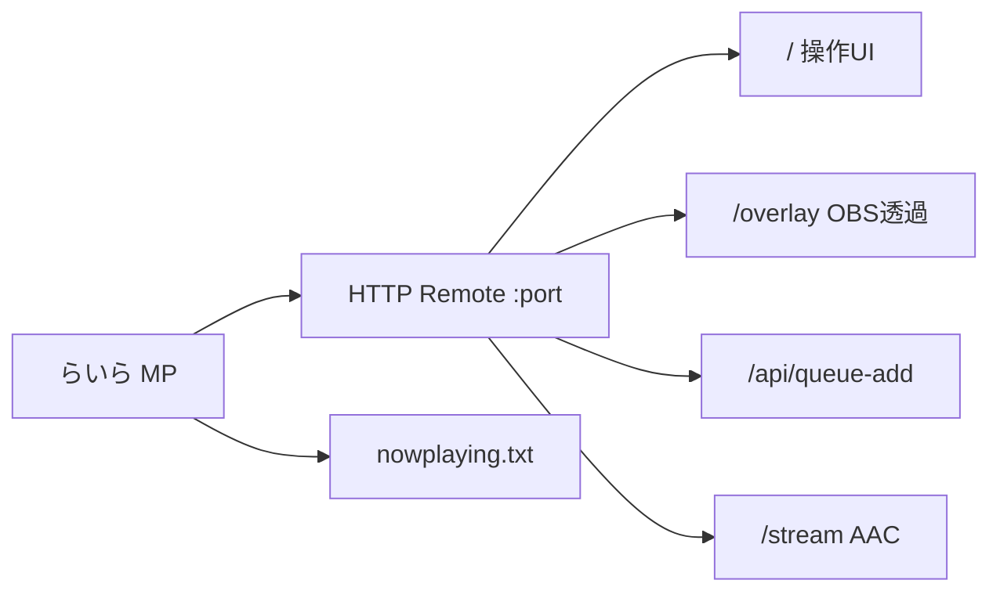
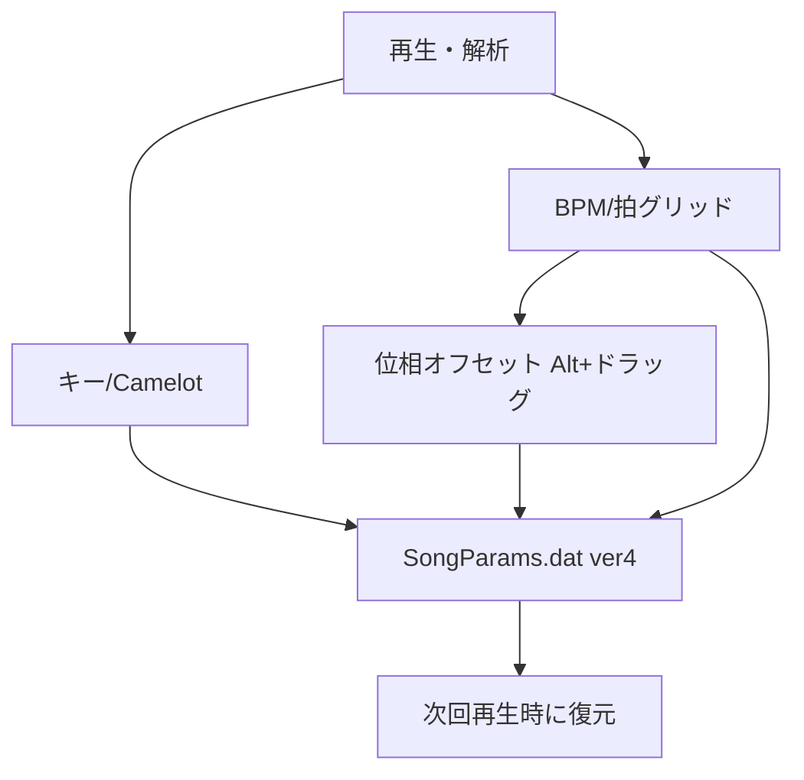

chachakotorinのgithubから移転です。

# oggYSEDbgm メディアプレイヤー「らいら」
日本ファルコム (Nihon Falcom) BGMプレイヤー / 高機能メディアプレイヤー

**対応OS:** Windows 11 以降

## 概要
このソフトは、イースシリーズや軌跡シリーズなどの日本ファルコム作品のBGMファイル（Ogg, WAV, mp3等）を、**ゲーム中と同様にループ付きで再生**できるプレイヤーです。
また、DirectShowを使用した動画再生や、ハイレゾ音源（DSD/FLAC）の再生にも対応しています。

少し画面がグラフィカルになりました。
多言語化しました。
日本語"Japanese"、英語"English"、フランス語"Français"、イタリア語"Italiano"、スペイン語"Español"、韓国語"한국어"、中国語"中文"、アラビア語"العربية"、ロシア語"Русский"、ドイツ語"Deutsch"、ポルトガル語"Português"、オランダ語"Nederlands"、ポーランド語"Polski"、トルコ語"Türkçe"


### 環境モデル・イコライザー機能
イコライザー機能が追加され100種類の環境モデルや15バンドのイコライザーも実装されました。
イコライザープリセットも100個用意されています。
環境モデルで音割れ防止のため、楽曲が既に大きいボリュームの場合、ダイナミックコンプレッサーにより音割れしないよう処理が施されております。

グローバルパラメータとして、鮮明さ、低音域高音域バランス、音の密度、音の立体感、リバーブ、コーラス、ディレイも用意してあります。
これらは環境モデルとは別で動作します。
リバーブ／コーラス／ディレイは、スライダー後半でパンリバーブ、コーラスディストーション、マルチディレイ側にも振り分けられます。

また環境モデルのかかり方の度合いの変更できるため、かなり自由度が高くなっています。
現在のEQ／グローバル一式を **A/B スナップショット**として保存・適用・切替できます。

### ピアノロール機能
108鍵盤（表示レンジは 88／108 切替）の簡易ピアノロールが実装されました。右クリックメニューから操作でき、検出パラメータの微調整や、再生中のコード・メロディ表示、ノート名表示にも対応しています。再生（またはPC音譜面化）中の MIDI / MusicXML 録り（実験的）もできます。
表示は通常の2Dに加え **簡易3D**（視点ドラッグ・ホイールズーム）も選べます。

### 波形・周波数アナライザー
Ozone風のリアルタイムアナライザーを追加しました。

- **上部:** 多チャンネルPCM波形（横スクロール）と L/R レベルメーター（RMS＋RMSピークホールド）
- **下部:** 対数軸の周波数特性（複数の表示モード、ピークホールド）
- **表示モード:** Ozone / Cubase Frequency / Voxengo SPAN / Ableton Spectrum / FabFilter Pro-Q / バー / 線のみ（右クリック）
- **波形速度:** x0.25〜x2.0（右クリック）
- **レイアウト:** 重ね描き / 上下分割 / 左右分割 / 2x2 / 2x4（右クリックメニュー）
- **EQオーバーレイ:** 既存15バンドEQの帯域とゲイン曲線をスペクトラム上に表示
- **マウス読取:** ホバーで周波数・dB・チャンネル（分割時はカーソル下のパネル）を表示
- **操作:** フリーズ（F） / ピークホールド（P） / EQ表示（E） / ピークリセット（Space・ダブルクリック）
- **描画:** 解析ワーカースレッド＋UI自由走行（ピアノロールと同様）。アクリル（ぼかし）モードにも対応

メディアプレイヤー画面モードの再生中アイコン（♪点滅2コマ）と選択♡の描画順も整備しました。

### メディアプレイヤー画面モード搭載
普通のメディアプレイヤーのようなモード「らいら」を搭載。起動時にファルコムBGM画面との切り替えもできます（起動モード確認ダイアログで「次回も確認」も選べます）。

シークバーまわりを強化しています。

- **波形オーバービュー:** シークバー上に波形を表示（再生しながらリアルタイムで埋まり、WAVはファイル全体の概観に差し替え）。右クリックでON/OFF
- **ループとA-Bの分離:** ピンク帯／つまみがループ範囲、青がA-B。ロックチェックでループつまみを固定（既定ロック）
- **キュー / フレーズA-B / 練習テンポ:** キュー追加・1〜8でジャンプ、Rで現在±秒をA-B、テンポは 50/75/100% プリセットに加え **50〜200%** の連続調整
- **ジャケット残時間リング**、バナー（バー／ミラー／波形）と位相相関メーター（φ/LR）、シーク上の細いスペアナリボン
- **シーク右クリック:** シーク／ループ／A-B の調整、A/B 点セット、キュー追加など
- **拍グリッド位相:** シーク上で **Alt+ドラッグ** すると拍線の位相（オフセット）をずらせます。BPM／キーと一緒に曲ごとに記憶されます
- **LRCマーカー:** シーク波形下に水色の時刻線。クリックでその位置へシーク（A-B候補にも使えます）。ホバーで局所拡大ルーペ
- **キー／Camelot:** ツール「キー確定」で解析キーを曲に保存。相性候補は現プレイリストから隣接キーを列挙
- **Up Next キュー**（一覧・並替）、**スマートプレイリスト**／**Lib（書庫）ツリー**（ルート追加・PC／スマートPLノード）、一時プレイリスト、欠損ヒート＋整理、重複ダイアログ、フォルダ同期リスト、★レーティング
- **セット章:** リスト右クリックで Warmup / Peak / Cooldown タグ（セット構成の目安）
- **書き出しクロスフェード帯プレビュー**、拍グリッド、LRC微調整、スリープ（カスタム分＋残り表示）
- **再生履歴タイムライン**（日付ヘッダ・最大64件）
- シークホバーで時刻チップ、A-B周回回数表示（L%d）
- プレイヤー内の **カラオケ風歌詞パネル**（スクロール表示。別窓の歌詞ウィンドウとは独立）

シーク周りのイメージ:

```text
 ┌──────────────────────────────────────────────┐
 │  波形オーバービュー（最奥）                    │
 │  ┃ ┃ ┃ ┃  拍グリッド（Alt+ドラッグで位相）      │
 │  ┊ ┊ ┊     LRC 水色マーカー（クリックでシーク） │
 │  ████ピンク=ループ██  青A──青B   ♥再生位置     │
 └──────────────────────────────────────────────┘
```

キー相性（Camelot）のイメージ:

```text
        7B   8B   9B
        7A  [8A]  9A     ← 現在キーの隣接＋相対が「相性候補」
```

### テンポ・ピッチ変更
再生中のテンポとピッチを、それぞれ独立して変えられます。

### 歌詞表示
.lrc形式の歌詞表示に対応しています。ネットからの歌詞取得（LRCLib／NetEase など）もできます。常時最前面の歌詞ウィンドウや、LRCの細かいずれ補正・保存も使えます。

### ジャケット・プレイリスト
アルバムジャケットの表示と、プレイリスト機能（m3u / m3u8 / pls / xspf の取り込みなど）があります。曲ごとの音量やEQなどの設定も覚えます。
「曲ごとに設定保存」のチェックを入れると、★付きの曲は保存済みパラメータを読み直して反映します。チェックを外すときは、その時点の設定をその曲へ保存してから無効化します。
フォルダの `cover.jpg` や代替ジャケットの再読込・画像保存にも対応しています。

### 連続再生クロスフェード
**連続再生 ON** のとき、メイン／メディプレのチェックと秒数（小数可・既定 5.00 秒）で、曲末から指定秒だけ次曲と等パワーで重ねてシームレスに切り替えます（書き出し用のクロスフェードとは別系統）。

- 終端手前で次曲を裏で soft-open し、指定秒のあいだ A/B を混合してから本流を次曲へ昇格
- 昇格時にプレイリストの♪・ジャケット差し替え・リストの時間／タグ欄を更新
- 動画扱いや再生できない行は飛ばして、次の音声曲へ進みます
- **WAVへ保存** と併用すると「チェック用」モードになり、最初に流した曲名の WAV へ追記し続けます。出力は余裕を見て **96 kHz / 2ch / 24bit**（聞こえている混合 PCM を変換）に固定。停止でファイルを確定します

### アクリル（ぼかし）UI
Windows 11のアクリル風ぼかし表示に対応しています。コンテキストメニューの「アクリルモード」から、設定を開かずに ON/OFF できます。

### コンテキストメニュー（描画・フォント）
カスタムコンテキストメニューの **メニュー描画方法**（出現／消失アニメ）を選べます。選んだ内容は保存され、次に開くメニューから反映されます。

- クラシック（フェード）／上下に伸びる／カーテン（上から）／ワイプ（横）／リップル（起点）
- ビッグバン／ブラックホール／螺旋（スパイラル）／花びら／ジッパー（左右交互）／オーロラ（波・既定）

メニュー用フォント（8–24pt、太字／斜体）もホバープレビュー付きで変更できます。

### 操作ガイド
メディアプレイヤーの「？」に加え、EQ・プレイリスト・動画・レンダリング・キャプチャ・アナライザ・ピアノロール・メイン画面など、各 UI から **操作ガイド**（GDIヘルプ）を開けます。コンテキストメニューの「操作ガイド」からも到達できます。

操作ガイドには、画面ミニマップに加え、**シーク層（波形／拍グリッド／LRC／ループ・A-B）**、**Camelot相性**、**セット章**、**Remote/OBS** などの図解も入っています。追加機能の位置づけが分かりにくいときは、まずここを開くと把握しやすいです。

### PCMアップスケール
サンプリングレートやビット深度のアップスケール、マルチチャンネル出力に対応しています。

### 演奏プロンプト
再生中にピッチやテンポ、エフェクトなどを時間指定で動かすプロンプト機能があります。テキスト編集のほか、曲を読みながらの解析・履歴の保存／読込、雰囲気モードにも対応しています。

### コマンドロール
プロンプトを時間軸のロール上で編集・配置できます（複数レーン）。メディアプレイヤー側から開けます。メイン画面に追随するロックや表示倍率の保存にも対応しています。

### 再生詳細
ギャップレス、ReplayGain、Mid/Side、相関メーター、書き出しリミッター、ループ区間、ループ境界フェード、キュー、タグ書き込み、簡易波形プレビューなどをまとめた設定です。メディアプレイヤー画面の「詳細」ボタン、またはプレイリストの右クリックから開けます。
タグ書き込みは **MP3 / FLAC / WAV / M4A / Ogg Vorbis** に対応しています（暗号化FLACやOpus書き込みは非対応）。

### ファイル情報
プレイリストやメディアプレイヤーの右クリック「ファイル情報」から、曲の表示名・アーティスト・アルバム・パス、タグ、ループなどを確認・編集できます。

- タグ→プレイリスト反映、タグ再読込、タグ書き込み（上記フォーマット）
- パス参照／Explorerで選択表示／パスコピー／ファイル名コピー
- ファイルの有無・拡張子・サイズ表示、曲ごと設定（★）の表示と削除
- 再生詳細へのジャンプ、ループの編集（OKでプレイリストへ保存）
- 複数選択時はアーティスト／アルバムの一括編集

### タグ編集
プレイリストの右クリック「タグ編集」から、タイトル／アーティスト／アルバムに加え、年・トラック・ジャンル・コメントやジャケットを編集してファイルへ書き込めます。複数選択時は空欄の項目は変えず、入力した項目だけ一括適用します。

### 音声書き出し（WAV / mp3 / FLAC）
プレイリストの右クリック「音声書き出し」から、選択曲を **WAV / mp3 / FLAC** に書き出せます（タブで形式切替）。いったん PCM（WAV経路）へレンダリングしたあと、必要ならエンコードします。

- **ループ回数**、**フェードアウト**、**先頭無音を揃える**（長い先頭無音はカット、短い場合は無音を足して指定秒に揃える）
- **サンプリング**（ソースのまま／44.1〜192 kHz）、KPI曲向けの**長さ(秒)**
- **タグとジャケットをコピー**、タイトル／アーティスト／アルバム／ジャケットの指定
- **プロンプト実行を適用**（書き出しPCMに演奏プロンプトを反映）
- **クロスフェード**（複数選択時）: 曲を1ファイルに順次連結し、曲間を指定秒で等パワー交差。コンテキストの「クロスフェード書き出し」からも起動可
- **ミックス**（複数選択時）: 同時に重ねる曲数と曲ごとの音量割合(%)を指定して1ファイルへ。クロスフェードと併用すると、終わった枠へ次曲を指定秒で補充投入

従来の WAV 書き出しと同様、2GB超は RF64 に対応しています。

### マイクミックス（再生中WAVへ）
「WAVへ保存」がONのとき、再生PCMにマイク入力をミックスして書き込めます。マイク端末はレンダリング設定（CRender）側で選び、ミックス量は0〜200%です。メディアプレイヤーのプレイリスト右クリックからもON/OFFできます。
連続再生クロスフェードと併用したときのチェック用ダンプ（96 kHz / 2ch / 24bit・先頭曲名へ追記）については、上記「連続再生クロスフェード」を参照してください。

### デバイス録音
メディアプレイヤー下段の「録音」から、再生端末のループバックを **WAV / mp3 / FLAC** に録音できます。端末・形式・品質・保存先を指定でき、マイクの同時ミックスにも対応しています。mp3 / FLAC はいったんWAV経由で変換します。

### 画面キャプチャ
同じく下段の「キャプチャ」から、画面を **MP4（H.264 + AAC）** で録画できます。**ライブ配信モード**では MP4 を作らず、ffmpeg 経由で YouTube Live / ニコニコ / カスタム RTMP へ送ります。

- **モード:** プライマリ画面 / 全モニタ（仮想デスクトップ） / ウィンドウ合成
- **ウィンドウ合成:** 複数ウィンドウをレイヤとして配置。プレビュー上でドラッグ移動・四隅での拡大縮小、Z順の入れ替え
- **システム音**（ループバック）と**マイク**の有無、FPS、出力解像度
- **MPの曲を載せる:** 開いているメディアプレイヤー画面を合成に含め、配置・サイズを調整可能
- プレビューは録画中も更新されます（枠やHUDは録画ファイルには入りません）
- **ライブ配信:** Live チェック ON。YouTube は Google OAuth Client ID/Secret → 認証 → 配信枠作成（タイトル／公開・限定・非公開）→ 配信開始。ニコニコ／カスタムは配信ページの RTMP URL＋キーを入力。実行ファイル隣（または `ogg_binary`）に **ffmpeg.exe** が必要です

### 附属ツール（らいら）
メディアプレイヤーのツール右クリック／各ウィンドウの右クリックから使える、プレイヤー附属の便利機能です。

- **歌詞ウィンドウ:** 常時最前面の歌詞表示。透明度・表示行数・フォント・位置を覚えます。LRC は ±10/±50/±100ms のずれ補正とファイル保存にも対応。メディアプレイヤーの歌詞▾右クリックからも開けます
- **ピアノロール拡張:** 再生中の MIDI / MusicXML 録り（実験的・停止時はPC音自動連動）、コード進行パネル、PC音（ループバック）の譜面化
- **スペクトロジャケット:** アナライザ表示を画像として保存
- **A-B／キュー素材パック:** A-B やキュー区間を連番で書き出し
- **音量正規化バッチ:** 選択曲を目標ラウドネス寄りに書き出し（リミッタ併用）
- **MusicBrainz 自動タグ:** 曲名・アーティストなどから候補を引いてタグ反映（指紋照合なし）
- **ボーカルキャンセル／強調:** Mid 成分の減衰・強調。ProTools から操作
- **M/S プリセット:** 相関まわりから狭める／広げる／モノをワンクリック
- **キー→EQ提案:** 検出キーからプリセットを提案
- **BPM計測:** 再生またはPC音を聴きながらチェックONで計測し、OFFで拍グリッドや書き出しクロスフェード秒に反映
- **キー確定／Camelot相性:** 解析キーを曲ごとに記憶。ツールから相性候補（隣接キー）を次曲候補として列挙
- **DJパッド:** ピッチ／テンポ／ボーカル／M/S に加え、レコードスクラッチ、Kill（低／中／高）、±拍、ホットキュー、A-B、フィルタ／FX／速度、3バンドEQ などをワンタッチ
- **MIDIキーボード操作:** ノート／CC で再生・次曲・音量など。**MIDI学習**で CC をテンポ／EQ 帯へ割り当て可能
- **トランジション・プリセット:** EQスイープ／フィルタ／クロスフェード秒の数種を「次曲向け」に適用（時系列オートメーション本体はなし）
- **ライブセット録画:** 画面キャプチャとデバイス録音をまとめて開く（ゲーム録画プリセットの拡張）
- **動画の音声抽出／差し替え:** 選択動画から WAV 抽出、または外部 WAV で音声を差し替えて MP4 へ書き出し
- **出力ミラー:** 別再生デバイスへ同じミックスをミラー（音量のみ別）。**Mirror CUE** 切替と独立ゲインあり
- **スクリーンセーバー風ビジュアライザ:** フルスクリーン表示（ESCで解除）
- **ローカルリモート:** 同じ Wi-Fi / LAN 上の PC・スマホ（同時最大6台）からブラウザで再生操作。操作／EQ／プレイリスト／歌詞／DJスクラッチ（レコード盤）／ピアノ／アナ のタブ。設定に表示される `http://（LANのIP）:ポート/` を開く（PC では `127.0.0.1` でも可）。インターネットへの公開はしません。初回は Windows ファイアウォールの許可が必要なことがあります
  - **OBS用** `http://…/overlay` …… 透過タイトル／状態の簡易HTML
  - **共同キュー** `…/api/queue-add?i=行番号` …… ローカル用途（認証なし・既存Remoteと同水準）
  - **AACプロファイル** …… 128 / 192 / 低遅延96 kbps 切替
- **nowplaying.txt:** 実行ファイルフォルダへ現在曲を書き出し（Discord本体連携はファイル出力のみ）
- **フォーカスモード／危険操作確認／レイアウト1–3／週次サマリ／練習ログ** …… ツールメニューから
- **アラーム:** 指定時刻に再生開始（スリープタイマーは従来どおり）
- **ゲーム録画プリセット:** 画面キャプチャ＋デバイス録音を所定設定でまとめて開く（ネット配信ではない）
- **リスト削除の1段Undo:** 右クリック「削除を元に戻す」（フル履歴Undoではありません）

Remote / OBS の関係:



曲パラメータ（記憶）の流れ:




## 対応ゲームタイトル
以下のゲームのBGMループ再生に対応しています。

### イース (Ys) シリーズ
- イース6 ナプシュテムの匣
- イース フェルガナの誓い
- イース・オリジン
- Ys I&II Chronicles / 完全版
- Steam版 Ys セルセタの樹海
- Steam版 Ys VIII (Ys8)
- Steam版 Ys IX (Ys9)
- Steam版 Ys X (Ys10)

### 軌跡 (Trails) シリーズ
- 英雄伝説6 空の軌跡 FC / SC / The 3rd (Steam版 The 1st含む)
- 英雄伝説 零の軌跡
- 英雄伝説 碧の軌跡
- Steam版 閃の軌跡 I / II / III / IV
- Steam版 創の軌跡
- Steam版 黎の軌跡 II
- Steam版 界の軌跡

### その他のファルコム作品 / 他社作品
- Zwei!! (CD版はADPCM、DVD版WAVはPCM処理)
- Zwei II
- XANADU NEXT
- アークトゥルス
- ぐるみん (※データ頭のRIFF検索によるADPCM対応)
- ソーサリアン オリジナル
- ダイナソア リザレクション
- ブランディッシュ4 眠れる神の塔
- **ガガーブトリロジー三部作**
  - 白き魔女
  - 朱紅い雫
  - 海の檻歌
- 西風の狂詩曲 (ラプソディー)
- 月影のデスティニー (mp3)
- 幻想三国志 1 / 2 (mp3)

## 主な機能

### 1. ゲームBGM再生・変換
- **ループ再生:** ゲーム内と同じように自然にループ再生します。
- **フォーマット変換:** Ogg, mp3などのゲーム内BGMをWAVファイルに変換可能です。Ver0.4b以降はフェードアウト機能にも対応。
- **フォルダ設定:** インストールされているゲームフォルダを指定して読み込みます（初期設定はデフォルトインストールフォルダ）。

### 2. 一般オーディオ再生
以下のフォーマットの再生に対応しています。
- mp3, m4a, aac, alac, flac, tta, ape
- DSD (dsf, dff)
- OggOpus (48k)
- Kb Media Playerの旧kpiプラグインと新kpiの一部に対応 (Pluginsフォルダに入れて使用。64bit版はKpiHost64経由)
  - kpi一覧では拡張子テキストで絞り込みできます（入力すると即座に反映。チェック状態は曲単位で保持）

### 3. 動画再生 (DirectShow)
avi, mpgなどのDirectShow対応動画を再生可能です。Windows Vista以降ではEVRを使用し、高画質で再生します。映像・音声・字幕ストリームの切り替えにも対応しています。
※ avi等の再生にはコーデックパック（K-Lite Codec Pack等）が必要です。
[解説サイト: ppp.oohara.jp/k-lite.html](http://ppp.oohara.jp/k-lite.html)

#### 動画再生中の操作・ショートカット

| 操作 | 機能 |
| :--- | :--- |
| **右クリック** | 画面サイズ変更 (1倍 / 1.5倍 / 2倍) |
| **ダブルクリック** | フルスクリーン切り替え |
| **ホイール / ドラッグ** | ウィンドウサイズ変更 |
| **C キー** | 一時停止 |
| **↑ / ↓ キー** | 音量調整 |
| **← / → キー** | シーク (早送り/巻き戻し) |

### 補足
- ランダム再生、連続再生、ループ回数の指定、A-Bリピート
- **連続再生クロスフェード**（曲末の等パワー混合・秒数指定。書き出しクロスフェードとは別）
- シーク波形オーバービュー、ループつまみロック、Up Next、スリープタイマー
- ファイルのドラッグ＆ドロップ追加
- mp3やDirectShow再生の途中位置の保存
- 音声書き出し（WAV / mp3 / FLAC。ループ／フェード／先頭無音揃え／クロスフェード／同時ミックス／サンプリング指定）
- WAV書き出し時の2GB超対応（RF64）
- マイクミックス（WAVへ保存時）、デバイス録音（ループバック→WAV/mp3/FLAC）、画面キャプチャ（MP4）
- 連続再生クロスフェードON時のWAV保存チェック用ダンプ（先頭曲名へ追記・96k/2ch/24bit）
- 歌詞ウィンドウ、LRC微調整／保存、ピアノロールのMIDI・MusicXML録り、PC音譜面化、簡易3D表示
- A-B／キュー素材パック、音量正規化バッチ、MusicBrainz自動タグ、ボーカルMid、M/Sプリセット、キーEQ提案
- BPM計測、DJパッド（スクラッチ／Kill／ホットキュー等）、MIDI操作、動画音声抽出、出力ミラー、SS風ビジュアライザ
- ローカルリモート（LAN／同時6台・タブ：操作/EQ/リスト/歌詞/DJスクラッチ/ピアノ/アナ）、アラーム、ゲーム録画プリセット、画面キャプチャのライブ配信（YouTube API / RTMP）
- ピアノロールの検出パラメータ調整ダイアログ（多数スライダー）、88／108鍵レンジ
- プレイリストからアナライザー／ピアノロールを直接開く
- 並べ替え、他プレイリストへの移動・コピー、選択曲のジャケ再取得、一時プレイリスト
- 欠損ファイル確認（パス修正・適用・インライン編集）と欠損マークの再スキャン
- プレイリスト取り込み（m3u / m3u8 / pls / xspf。UTF-8、相対パス、欠損／重複スキップなど）
- レンダリング設定（デバイス、バッファ、ビット深度、フォント、ファイル関連付け、**言語（14言語）**、スペアナ音階モードなど）
- ファイル関連付けは音声に加え動画（avi/mp4/mkv/wmv/mov/webm 等）とプレイリスト（m3u 等）にも対応
- タスクバーのジャンプリスト（最近再生した曲、再演奏／停止／前後曲、EQ、ジャケット、レンダ、フォルダなど）
- タスクバーサムネイルツールバー（再演奏／一時停止／停止／次曲など）
- コンテキストメニューの描画アニメ・フォント、アクリル即切替、各窓の操作ガイド
- 起動時・定期の更新チェック
- Windowsミキサーでアプリがミュートされているときの警告
- メディアプレイヤー側の最小化連動やツールチップ表示など
- メイン画面を動かすと関連ウィンドウが追随（各サブ窓の追随ロック）
- 曲ごと設定のON/OFF時の復元・保存、ファイル情報／タグ編集画面の操作
- タグ書き込み（MP3 / FLAC / WAV / M4A / Ogg Vorbis）
- kpi一覧の拡張子絞り込み
- 拡張音量（主音量／EQマスターとは別系統）
- Soft3D迷路（おまけ・下段ボタンから。地下階層・曲連動アイテムあり）

## おまけ：Soft3D迷路
メディアプレイヤー下段の **迷路** ボタンから開ける、DirectX11 の一人称迷路です。BGMを聴きながらの息抜き用で、本編の再生機能とは別枠のおまけです。

- **操作:** WASD／矢印で移動、Q・E（または ←→）で旋回。右クリックでサイズ再生成・ミニマップ・アイテム種類など。?ヘルプに Soft3D／説明の凡例表あり
- **マップ:** 右上ミニマップ。SPACE押しっぱなし／ホイールクリックで全体マップ（地下あり時は ←→ やホイールで階層切替）。壁は地図上で太めに表示
- **曲連動:** 浮遊球でテンポ↑↓／ピッチ↑↓／前後曲／音量／EQ・平坦／リバーブ／クロスフェード／ランダム切替など。全階に配置。窓は通過不可の飾り
- **地下:** 「地下」コンボで 0〜3F。壁・床のモチーフは階ごと（地上=レンガ／B1=湿った石／B2=錆び金属／B3=火山岩）。橙の階段＝下り、水色＝上り（斜め2マス）。半透明トラップ（粘液・棘・氷・闇、ワープなし）あり。旧セーブの同一マス階段は自動再生成。ゴールは難易度に応じてどこかの階
- **難易度:** 超簡単〜超難しい。難しいほど細い通路・階段が多く上下往復し、トラップも増えやすい
- **見た目:** 地上は草木付きレンガ、地下は階ごとの壁・床・霧。進行は自動保存され、開き直すと続きから

## 注意事項
- **Brandish4 および ガガーブトリロジー**については、WAVファイルをHDDへコピーする必要があります（フォルダ名は `WAVE`, `WAVEDV`, `WAVEDVD` などゲームにより異なります）。
- ゲーム以外のWAVファイルはDirectShow扱いとなり、ループやフェードアウト機能は使用できません。

## クレジット
- スペアナ用FFT: Copyright Takuya OOURA, 1996-2001  
  http://www.kurims.kyoto-u.ac.jp/~ooura/fft-j.html
- ぐるみん BGM ループテーブル: ぽかん's Home Page（Falcom データアーカイブ 変換ツール Ver.0.16b）より拝借  
  http://www.geocities.jp/pokan_chan/#FALCNVRT

## ライセンス / 作者
Copyright (C) PrePrayerPower Soft
[https://ppp.oohara.jp/](https://ppp.oohara.jp/)


# oggYSEDbgm Media Player "Raira"
Nihon Falcom BGM Player / High-Performance Media Player

**Compatible OS:** Windows 11 or later

## Overview
This software is a specialized media player designed to play background music (Ogg, WAV, mp3, etc.) from **Nihon Falcom** titles—such as the *Ys* and *Trails* series—with the **exact loop points used in-game**.
Additionally, it supports high-resolution audio (DSD/FLAC) and video playback via DirectShow.

The interface is now more graphical and supports multiple languages.
**Supported Languages:**
Japanese, English, Français, Italiano, Español, 한국어, 中文, العربية, Русский, Deutsch, Português, Nederlands, Polski, Türkçe

### Environmental Modeling & Equalizer
An Equalizer function has been added, featuring **100 environmental models** and a **15-band EQ**.
100 EQ Presets are also included.
To prevent audio clipping when using environmental models, a **Dynamic Compressor** is implemented to automatically process tracks with high volume levels.

Global parameters such as **Sharpness**, **Low/High Balance**, **Sound Density**, **Stereo Depth**, **Reverb**, **Chorus**, and **Delay** are also available.
These operate independently of the environmental models.
For Reverb / Chorus / Delay, the upper half of each slider switches to pan reverb, chorus distortion, and multi delay.

Additionally, the intensity of the environmental effects can be adjusted, offering a high degree of acoustic freedom.
You can store and recall the current EQ / global set as **A/B snapshots**.

### Piano Roll Feature
A simplified piano roll with an **88 / 108-key** display range has been implemented. Use the right-click menu for controls, detection tuning, chord/melody display, and note-name labels during playback. MIDI / MusicXML capture while playing (or PC-audio score) is experimental, and PC loopback audio can feed the roll.
Besides flat 2D, a **simple 3D** view (drag to orbit, wheel to zoom) is available.

### Waveform & Spectrum Analyzer
An Ozone-inspired real-time analyzer has been added.

- **Top:** Multi-channel scrolling PCM waveform with L/R level meters (RMS + RMS peak hold)
- **Bottom:** Log-frequency spectrum (multiple display modes, with peak hold)
- **Display modes:** Ozone / Cubase Frequency / Voxengo SPAN / Ableton Spectrum / FabFilter Pro-Q / Bars / Line only (right-click)
- **Wave speed:** x0.25–x2.0 (right-click)
- **Layouts:** Overlay / split vertical / split horizontal / 2x2 / 2x4 (right-click menu)
- **EQ overlay:** Shows the existing 15-band EQ band markers and gain curve on the spectrum
- **Mouse readout:** Hover to read Hz, dB, and channel (on split layouts, the panel under the cursor)
- **Controls:** Freeze (F) / Peak hold (P) / EQ overlay (E) / Reset peaks (Space or double-click)
- **Rendering:** Analysis worker thread with free-running UI present (same approach as the piano roll), including Acrylic (blur) mode support

Playback note icon blinking (two frames) and heart (♡) draw order on the media-player list were also fixed.

### Media Player Screen Mode Included
Includes a media-player mode called **Raira**. You can choose between the Falcom BGM screen and this mode at startup (optional “ask again next time” on the startup-mode dialog).

The seek bar area has been expanded:

- **Waveform overview:** Waveform on the seek bar (fills in real time during playback; WAV can be replaced by a full-file overview). Toggle via right-click
- **Separate loop vs A-B:** Pink band/thumbs are the loop range; blue is A-B. A lock checkbox freezes the loop thumbs (locked by default)
- **Cues / phrase A-B / practice tempo:** Add cues and jump with 1–8, R sets A-B around now ±seconds; tempo presets 50/75/100% plus continuous **50–200%**
- **Jacket remaining-time ring**, banner modes (bars / mirror / wave) with phase correlation (φ/LR), and a thin spectrum ribbon on the seek bar
- **Seek right-click menu:** adjust seek / loop / A-B, set A/B points, add cues, and more
- **Up Next queue** (panel + reorder), **smart playlists** / **Lib (library) tree** (roots, PC / smart-PL nodes), temporary playlists, missing heat + manage, dupes dialog, folder sync lists, and ★ ratings
- Export crossfade-band preview, beat grid, LRC nudge, sleep timer (custom minutes + countdown)
- Play-history timeline (date headers, up to 64 entries)
- Seek hover time tip and A-B loop count display (L%d)
- In-player **karaoke-style lyrics panel** (scrolling; independent from the separate lyrics window)

### Tempo & Pitch Control
Tempo and pitch can be adjusted independently during playback.

### Lyrics Display
Supports .lrc lyrics display, including optional online lyric lookup (LRCLib / NetEase, etc.). An always-on-top lyrics window and fine LRC timing shift/save are also available.

### Jacket Art & Playlist
Album jacket display and playlists are supported (import m3u / m3u8 / pls / xspf, among other features). Per-track settings such as volume and EQ are remembered.
Turning **Save per-song** on reloads and applies saved parameters for tracks marked with ★. Turning it off saves the current settings for that track before disabling the feature.
Folder `cover.jpg`, alternate jacket reload, and saving jacket images are also supported.

### Continuous-Play Crossfade
With **continuous play ON**, use the main / media-player checkbox and duration (decimals allowed; default **5.00** seconds) to equal-power blend into the next track for that many seconds at the end—seamless handoff (separate from export crossfade).

- Soft-opens the next track in the background near the end, mixes A/B for the chosen window, then promotes the next track to the main stream
- On promote: playlist ♪, jacket swap, and list duration / tag fields update
- Skips video rows and unplayable entries, continuing to the next audio track
- Combined with **Save to WAV**, this becomes a **verification dump**: one WAV named after the first track, appended continuously at a fixed **96 kHz / 2ch / 24-bit** (converted from the audible mix). Stopping playback finalizes the file

### Acrylic (Blur) UI
Supports Windows 11 acrylic-style blur for the interface. Toggle it from the context-menu **Acrylic mode** item without opening Settings.

### Context Menu (animation & font)
Custom context menus offer **menu animation** styles for show/hide. The choice is saved and applies from the next menu open.

- Classic (fade) / Expand up-down / Curtain (from top) / Wipe (horizontal) / Ripple (from click)
- Big Bang / Black Hole / Spiral / Petals / Zipper (L/R) / Aurora (wave, default)

Menu font (8–24 pt, bold/italic) can be changed with hover preview.

### Operation Guides
Besides the media player **?**, GDI operation guides are available from EQ, playlist, video, rendering, capture, analyzer, piano roll, main window, and more—also via each window’s context-menu **Operation guide** item.

### PCM Upscaling
Supports sample-rate / bit-depth upscaling and multi-channel output.

### Performance Prompt
A timed prompt feature can change pitch, tempo, effects, and more during playback. Besides text editing, it supports analyze-while-listening, history save/load, and atmosphere modes.

### Command Roll
Edit and place prompt commands on a time-based roll (multiple lanes). Open it from the media player. Follow-main lock and zoom level can be remembered.

### Playback Details
Gapless playback, ReplayGain, Mid/Side, correlation meter, export limiter, loop points, loop-boundary fade, cues, tag writing, and a simple waveform preview are grouped in one window. Open it from the media player **Extra** button or the playlist context menu.
Tag writing supports **MP3 / FLAC / WAV / M4A / Ogg Vorbis** (encrypted FLAC and Opus writing are not supported).

### File Info
From the playlist or media-player context menu (**File Info**), you can view and edit display name, artist, album, path, tags, loops, and more.

- Apply tags → playlist fields, reload tags, write tags (formats above)
- Browse path / select in Explorer / copy path / copy file name
- Missing-file / extension / size status, and per-song settings (★) summary with clear
- Jump to Playback Details; edit loop points (saved to the playlist on OK)
- With multiple tracks selected, batch-edit artist / album

### Tag Edit
From the playlist context menu (**Edit tags**), edit title / artist / album plus year, track, genre, comment, and cover art, then write to the file. With multiple selection, blank fields are left unchanged and only filled fields are applied to all.

### Audio Export (WAV / mp3 / FLAC)
From the playlist context menu (**Audio export**), write selected tracks as **WAV / mp3 / FLAC** (format tabs). Audio is rendered through the PCM/WAV path, then encoded when needed.

- **Loop count**, **fade-out**, and **align leading silence** (trim if longer than N seconds; pad silence if shorter)
- **Sample rate** (source / 44.1–192 kHz) and KPI **length (sec)** when needed
- **Copy tags and cover**, plus optional title / artist / album / cover override
- **Apply prompt execution** (bake performance prompts into the exported PCM)
- **Crossfade** (multi-select): join tracks into one file with equal-power overlaps; also available via **Crossfade export…**
- **Mix** (multi-select): layer a chosen number of tracks at once with per-track volume % into one file; with Crossfade on, refill ended slots over the given seconds

Exports larger than 2GB use RF64, same as the traditional WAV path.

### Mic Mix (into live WAV save)
When **Save to WAV** is on, microphone input can be mixed into the PCM being written. Pick the capture device in Rendering (CRender); mix level is 0–200%. You can also toggle it from the media-player playlist context menu.
For the verification dump when combined with continuous-play crossfade (96 kHz / 2ch / 24-bit, append under the first track’s name), see **Continuous-Play Crossfade** above.

### Device Recording
From the media player **Record** button, capture playback-device loopback to **WAV / mp3 / FLAC**. Choose device, format, quality, and path; optional mic mix is available. mp3 / FLAC go through a temporary WAV encode step.

### Screen Capture
From **Capture**, record the screen to **MP4 (H.264 + AAC)**.

- **Modes:** primary monitor / all monitors (virtual desktop) / window composition
- **Window composition:** place multiple windows as layers; drag to move, corner handles to resize, Z-order controls
- Optional **system audio** (loopback) and **microphone**, FPS, and output resolution
- **Include MP song:** composite the open media-player window and adjust its layout on the preview
- Preview keeps updating while recording (HUD overlays are not written into the file)

### Companion Tools (Raira)
Handy media-player add-ons from the Tools right-click menu and each window’s context menu.

- **Lyrics window:** Always-on-top lyrics display; remembers opacity, visible lines, font, and position. LRC shift ±10/±50/±100 ms and save to file. Also openable from the media player lyrics ▾ right-click menu
- **Piano-roll extras:** Experimental MIDI / MusicXML capture during playback (auto PC-audio when idle), chord panel, score-from-PC-audio (loopback)
- **Spectrogram jacket:** Save the analyzer view as an image
- **A-B / cue pack export:** Write A-B and cue ranges as numbered files
- **Loudness normalize batch:** Export selected tracks toward a target loudness (with limiter)
- **MusicBrainz auto-tag:** Look up by title/artist (no fingerprinting) and apply tags
- **Vocal cancel / emphasize:** Mid attenuation or boost from Pro Tools
- **M/S presets:** One-click narrow / wide / mono from correlation tools
- **Key → EQ suggest:** Propose an EQ preset from detected key
- **BPM measure:** Check while playing or with PC audio; uncheck to apply to beat grid and export crossfade seconds
- **DJ pad:** Pitch / tempo / vocal / M/S plus vinyl scratch, Kill (low/mid/high), ±beat, hot cues, A-B, filter/FX/speed, and a 3-band EQ
- **MIDI keyboard control:** Notes / CC for play, next, volume, etc.
- **Video audio extract / replace:** Export audio from a selected video to WAV, or replace the video’s audio with an external WAV and write MP4
- **Output mirror:** Mirror the same mix to another playback device (separate volume only)
- **Screensaver-style visualizer:** Fullscreen display (ESC to exit)
- **Local remote:** Browser transport from PCs/phones on the same Wi-Fi / LAN (up to 6 clients). Tabs: transport / EQ / playlist / lyrics / DJ scratch / piano / analyzer. Open the `http://(LAN IP):port/` shown in settings (on the PC, `127.0.0.1` also works). Not exposed to the public Internet; Windows Firewall may prompt once
- **Alarm:** Start playback at a set time (sleep timer remains as before)
- **Game-capture preset:** Open screen capture + device record with preset settings (local recording, not internet streaming)
- **Live streaming (screen capture):** Live checkbox → YouTube (OAuth + Live API: title/privacy) or Niconico/Custom RTMP URL+key. Requires `ffmpeg.exe` beside the exe (or under `ogg_binary`). Does not write MP4 while live.


## Supported Game Titles
The player supports seamless BGM looping for the following titles:

### Ys Series
- Ys VI: The Ark of Napishtim
- Ys: The Oath in Felghana
- Ys Origin
- Ys I & II Chronicles / Complete
- Ys: Memories of Celceta (Steam)
- Ys VIII: Lacrimosa of DANA (Steam)
- Ys IX: Monstrum Nox (Steam)
- Ys X: Nordics (Steam)

### Trails Series
- The Legend of Heroes: Trails in the Sky FC / SC / the 3rd (Including Steam 1st)
- The Legend of Heroes: Trails from Zero
- The Legend of Heroes: Trails to Azure
- The Legend of Heroes: Trails of Cold Steel I / II / III / IV (Steam)
- The Legend of Heroes: Trails into Reverie (Steam)
- The Legend of Heroes: Trails through Daybreak II (Steam)
- The Legend of Heroes: Trails beyond the Horizon (Steam)

### Other Falcom & Third-Party Works
- Zwei!! (ADPCM for CD version / PCM for DVD version)
- Zwei: The Ilvard Resurrection
- Xanadu Next
- Arcturus
- Gurumin (ADPCM support via RIFF header search)
- Sorcerian Original
- Dinosaur Resurrection
- Brandish 4: The Tower of Sleeping God
- **Gagharv Trilogy:**
  - White Witch
  - A Tear of Vermillion
  - Cagesong of the Ocean
- The Rhapsody of Zephyr
- Destiny of the Light and Shadow (mp3)
- Genso Sangokushi 1 / 2 (mp3)

## Key Features

### 1. Game BGM Playback & Conversion
- **Seamless Looping:** Replicates the natural in-game music transitions.
- **Format Conversion:** Convert Ogg or mp3 game files to WAV. (Fade-out support added in Ver 0.4b).
- **Directory Mapping:** Scan your installed game folders (defaults to standard installation paths).

### 2. General Audio Playback
Supports the following formats:
- mp3, m4a, aac, alac, flac, tta, ape
- DSD (dsf, dff)
- OggOpus (48k)
- Legacy and modern **kpi plugins** (Kb Media Player) are supported (place in the `Plugins` folder; the 64-bit build uses KpiHost64).
  - The kpi list can be filtered by extension text (updates as you type; checkbox state is kept per plugin)

### 3. Video Playback (DirectShow)
Plays avi, mpg, and other DirectShow-compatible formats. On Windows Vista and later, it utilizes **EVR (Enhanced Video Renderer)** for high-quality output. Video, audio, and subtitle stream switching is also supported.
*Note: Playback of certain formats may require codec packs (e.g., K-Lite Codec Pack).*
[Instructional Site: ppp.oohara.jp/k-lite.html](http://ppp.oohara.jp/k-lite.html)

#### Video Controls & Shortcuts

| Action | Function |
| :--- | :--- |
| **Right-Click** | Change Window Size (1x / 1.5x / 2x) |
| **Double-Click** | Toggle Fullscreen |
| **Wheel / Drag** | Resize Window |
| **C Key** | Pause / Resume |
| **Up / Down Arrow** | Volume Control |
| **Left / Right Arrow** | Seek (Rewind / Fast Forward) |

### Additional Notes
- Random play, continuous play, loop-count settings, and A-B repeat
- **Continuous-play crossfade** (equal-power blend at track end; duration in seconds—separate from export crossfade)
- Seek waveform overview, loop-thumb lock, Up Next, and sleep timer
- Drag-and-drop file adding
- Resume position for mp3 and DirectShow playback
- Audio export (WAV / mp3 / FLAC; loop / fade / leading-silence align / crossfade / concurrent mix / sample-rate)
- WAV export larger than 2GB (RF64)
- Mic mix (with Save to WAV), device recording (loopback → WAV/mp3/FLAC), screen capture (MP4)
- WAV verification dump while continuous-play crossfade is on (append to first-track name; fixed 96 kHz / 2ch / 24-bit)
- Lyrics window, LRC nudge/save, piano-roll MIDI/MusicXML capture, score from PC audio, simple 3D view
- A-B/cue pack export, loudness normalize batch, MusicBrainz auto-tag, vocal Mid, M/S presets, key→EQ suggest
- BPM measure, DJ pad (scratch / Kill / hot cues, etc.), MIDI control, video audio extract, output mirror, screensaver visualizer
- Local remote (LAN / up to 6 clients; tabs: transport/EQ/list/lyrics/DJ scratch/piano/analyzer), alarm, game-stream preset
- Piano-roll detection tuning dialog (many sliders), 88 / 108-key range
- Open analyzer / piano roll directly from the playlist
- Sort, move/copy to another playlist, refresh jacket for selection, temporary playlists
- Missing-file review (path fix / apply / inline edit) and missing-mark rescan
- Playlist import (m3u / m3u8 / pls / xspf; UTF-8, relative paths, skip missing/duplicates)
- Rendering options (device, buffer, bit depth, fonts, file associations, **language (14 locales)**, spectrum scale mode, etc.)
- File associations cover audio plus video (avi/mp4/mkv/wmv/mov/webm, etc.) and playlists (m3u, etc.)
- Taskbar jump list (recent tracks, replay/stop/prev/next, EQ, jacket, render, folder, and more)
- Taskbar thumbnail toolbar (replay / pause / stop / next, etc.)
- Context-menu animation & font, acrylic quick toggle, per-window operation guides
- Startup and periodic update checks
- Warning when the app is muted in the Windows volume mixer
- Media-player extras such as minimize sync and tooltips
- Related windows follow when the main window is moved (per-window follow lock)
- Per-song settings restore/save on feature toggle; File Info / Tag Edit tools
- Tag writing (MP3 / FLAC / WAV / M4A / Ogg Vorbis)
- kpi list extension filter
- Extended volume (separate from main volume / EQ master)
- Soft3D maze (bonus; bottom-bar button; basements and track-linked items)

## Extra: Soft3D Maze
A first-person DirectX 11 maze opened from the media player’s bottom-bar **Maze** button. It’s a light distraction while BGM plays—separate from the core playback features.

- **Controls:** WASD / arrows to move, Q·E (or ←→) to turn. Right-click for regenerate size, minimap, item types, and more
- **Maps:** Top-right minimap. Hold SPACE or middle-click for the full overview (with basements: ←→ or mouse wheel switches floors)
- **Track links:** Floating orbs adjust tempo↑ / pitch↑↓ / next track / EQ. Windows are decorative and block movement
- **Basements:** The basement combo adds 0–3 underground floors. Orange stairs go down, cyan stairs go up. You move diagonally between floors and can glimpse adjacent levels through stair shafts (basements have ceilings). The goal sits on a floor chosen by difficulty
- **Difficulty:** Very easy–very hard. Affects corridor width, stair count, and 3D path length to the goal
- **Look:** Ground floor uses greenery; B1–B3 use stone / metal / dark rock motifs for walls and floors. Progress autosaves and resumes when you reopen the maze

## Important Notes
- **For Brandish 4 and the Gagharv Trilogy:** WAV files must be copied to your HDD (Folder names like `WAVE`, `WAVEDV`, or `WAVEDVD` vary by game).
- Standard WAV files (not from game data) are handled via DirectShow; therefore, loop and fade-out functions are not available for these files.

## Credits
- Spectrum FFT: Copyright Takuya OOURA, 1996-2001  
  http://www.kurims.kyoto-u.ac.jp/~ooura/fft-j.html
- Gurumin BGM loop table: courtesy of pokan's Home Page (Falcom data-archive converter Ver.0.16b)  
  http://www.geocities.jp/pokan_chan/#FALCNVRT

## License / Author
Copyright (C) PrePrayerPower Soft
[https://ppp.oohara.jp/](https://ppp.oohara.jp/)
